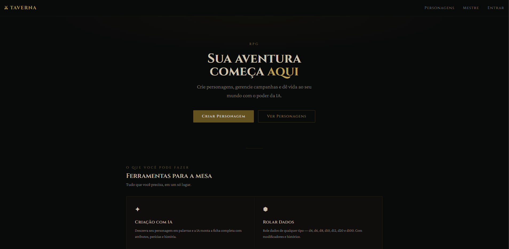
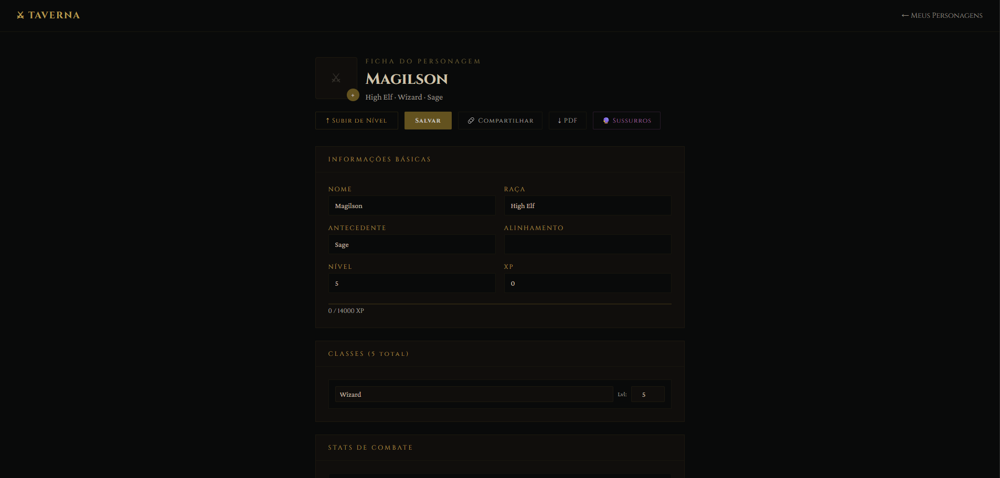
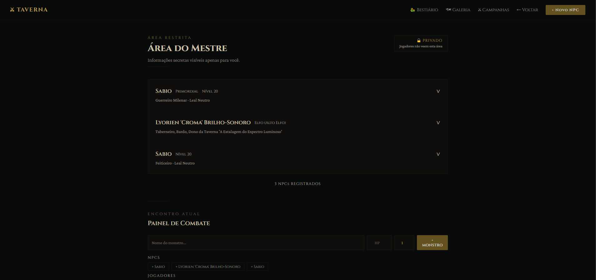
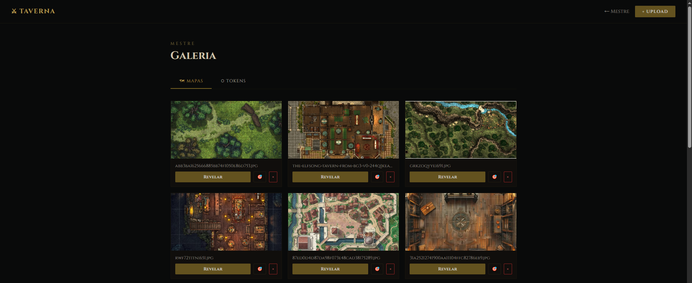

# ⚔ Taverna RPG

Plataforma web fullstack para mesas de RPG presencial com IA generativa, fichas interativas, battle map com tokens em tempo real e painel exclusivo para o mestre da campanha.

🔗 **[taverna-frontend.vercel.app](https://taverna-frontend.vercel.app)**

---

## 📸 Screenshots








---

## ✨ Funcionalidades

### 🎲 Jogador
- Criação de personagem via IA (descrição em linguagem natural) ou importação de PDF
- Ficha interativa completa — atributos, combate, magias, inventário, condições, recursos e descanso
- Foto de perfil do personagem (upload)
- Contador de moedas com conversão (PC → PP → PE → PO)
- Ataques salvos com rolagem de dado integrada
- Notas privadas por personagem
- Recursos com rastreamento de usos (descanso curto/longo)
- Exportação da ficha em PDF
- Compartilhamento de link público da ficha (leitura sem login)
- Envio de itens entre personagens
- Notificações push de sussurros do Mestre (funciona com app minimizado)
- Level up com IA e seleção de arquétipo por classe

### 🧙 Mestre
- Painel com NPCs, painel de combate, ferramentas e histórico
- Gerador de NPCs com IA (personalidade, segredos, motivações)
- Painel de combate com iniciativa, HP e barra de vida
- Bestiário com 60+ monstros canônicos D&D 5e e geração via IA
- Gerador de loot por nível e contexto
- Almanaque de itens mágicos com sistema de identificação e entrega para jogadores
- Battle map com tokens arrastáveis, rotação e escala em tempo real
- Galeria de mapas e imagens reveladas para jogadores em tempo real
- Transferência de itens entre jogadores
- Resumo de regras via IA
- Relógio de pressão (countdown por turno)
- Histórico de sessões
- Calculadora e distribuição de XP
- Gerador de encontros aleatórios
- Sussurros — mensagens secretas por personagem com notificação push
- Gerador de nomes por raça

### 🌐 Geral
- Login leve por apelido (sem senha, sem cadastro)
- Quadro de Rumores (post-its por categoria, visível para jogadores)
- Boatos de Taverna na Home
- PWA — instalável como app no celular
- Sistema de campanhas com código de convite

---

## 🛠 Stack

| Camada | Tecnologia |
|--------|-----------|
| Frontend | React, Tailwind CSS |
| Backend | FastAPI (Python) |
| Banco de dados | Supabase (PostgreSQL) |
| Storage | Supabase Storage |
| IA | Google Gemini 2.5 Flash |
| Notificações | Web Push API (VAPID) |
| Deploy Frontend | Vercel |
| Deploy Backend | Render |

---

## 🗄 Estrutura do Banco

```
characters         — fichas dos personagens (JSONB)
profiles           — usuários (login leve por apelido)
campaigns          — campanhas
campaign_members   — membros por campanha
npcs               — NPCs gerados pelo mestre
sessions           — histórico de sessões
magic_items        — almanaque de itens mágicos
bestiary           — bestiário de monstros
map_tokens         — tokens posicionados no battle map
gallery            — mapas e imagens da galeria
secret_messages    — mensagens secretas por personagem
rumors             — quadro de rumores
push_subscriptions — assinaturas de notificação por dispositivo
```

---

## 🚀 Rodando Localmente

```bash
# Instalar dependências
npm install

# Iniciar em desenvolvimento
npm start

# Build de produção
npm run build
```

---

## ⚙ Variáveis de Ambiente

```env
REACT_APP_API_URL=https://taverna-backend-eq3b.onrender.com
```

---

## 📁 Estrutura do Projeto

```
src/
├── components/       # Componentes reutilizáveis
├── context/          # UserContext (autenticação leve)
├── pages/
│   ├── Home.jsx
│   ├── Login.jsx
│   ├── Personagens.jsx
│   ├── Ficha.jsx
│   ├── FichaPublica.jsx
│   ├── CriarPersonagem.jsx
│   ├── Mestre.jsx
│   ├── Bestiario.jsx
│   ├── Galeria.jsx
│   ├── Quadro.jsx
│   ├── Historico.jsx
│   ├── Campanhas.jsx
│   └── RolarDados.jsx
└── services/
    └── api.js
```

---

## 🔗 Repositório do Backend

[github.com/Viinicius20/taverna-backend](https://github.com/Viinicius20/taverna-backend)
